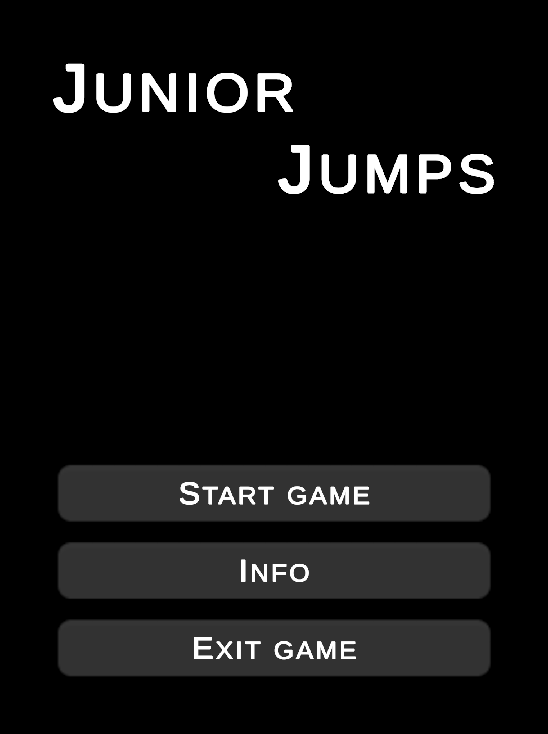

# Junior Jumps

## Description

**Junior Jumps** is a 2D platform game in which the player has to jump across platforms.

**Junior Jumps** is a game developed in Unity, the goal of the development was to create a game in which logic will not
be tied to "MonoBehaviours" and the game will be able to run on any platform.

It is now free and open source and always will be.

## Download

* Unity Project:
    * Clone this repository with git:
        ```shell
        git clone https://github.com/ShutovKS/JuniorJumps.git
        ```
    * [Download the latest release .zip](https://github.com/ShutovKS/JuniorJumps/archive/refs/heads/main.zip)


* Web releases:
    * [Itch.io](https://shutovks.itch.io/juniorjumps)


* Released versions:
    * [Windows](https://github.com/ShutovKS/JuniorJumps/releases)
    * [Android](https://github.com/ShutovKS/JuniorJumps/releases)
    * [WebGL](https://github.com/ShutovKS/JuniorJumps/releases)

## Prerequisites

To work on the project, you will need a Unity version of at least 2022.2.1f or higher (64-bit).

## Screenshots

### Main menu



### Game


### Main menu + Statistics


### Main menu - Info


## Credits

### Authors:

* Developer Shutov Kirill, Russia / Разработчик Шутов Кирилл, Россия

### Links:

* [Itch.io](https://shutovks.itch.io/juniorjumps)
* [GitHub - project](https://github.com/ShutovKS/JuniorJumps)
* [GitHub - developer](https://github.com/ShutovKS)

## License

Junior Jumps is licensed under the [MIT license](LICENSE.md).
